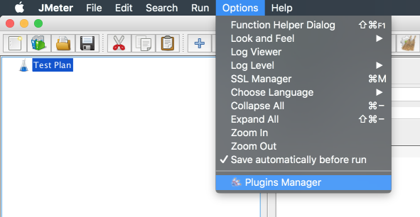

# JMeter installation guide

1. [JMeter](https://jmeter.apache.org/download_jmeter.cgi)
    * Download zip with JMeter 5.2.1
    * Unzip to [YOUR_JMETER_LOCATION]
2. [JMeter Plugins Manager](https://jmeter-plugins.org/install/Install/)
    * Download zip
    * Unzip to [YOUR_JMETER_LOCATION]/lib/ext

### Install JMeter plugins:

1. [Open JMeter](https://jmeter.apache.org/usermanual/get-started.html#running)
    * macOS: 
    ```
    ./apache-jmeter-5.2.1/bin/jmeter.sh
    ```
    * Windows:
    ```
    cd [YOUR_JMETER_LOCATION]/bin
    jmeter.bat
    ```
        

2. Open Options > Pluning Manager:

    
3. From `Available Plugins` tab choose the following:
* `3 Basic Graphs`
* `5 Additional Graphs`
* `Custom Thread Groups`

    and press `Apply Changes and Restart JMeter` button 
